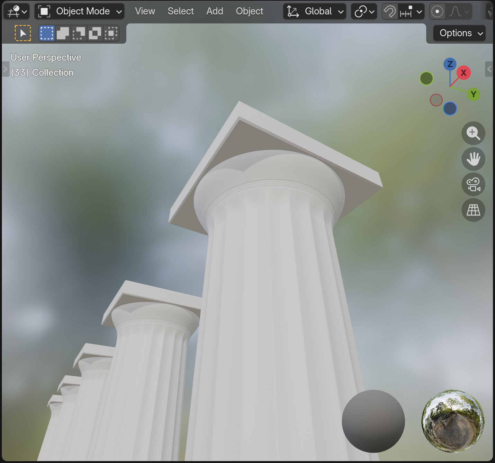

## Hellenic Doric Column (Blender Script)

A small Blender script that generates a **Parthenon-style Doric column** with reasonably accurate classical proportions, including **entasis**, **flutes**, **necking annuli**, and a **chamfered abacus**. If you are not familiar with the architectural terms, click [this](https://smarthistory.org/wp-content/uploads/2022/07/GreekOrdersAnnotated.jpg).

The script is **fully parametric** and built on Blender’s `bmesh` module. Default parameters are the data of a Parthenon Doric column, but modifications are also available for creating columns with different shapes. 

Mainly intended for architectural visualization, education and experimentation.

---

### Parameters

- **Scale**
  - `scale`: scaling factor. 1 module = `scale` meters

- **Segmentation**
  - `vertical_seg`: vertical segments count. 
  - `radial_seg`: radial segments count.
  - **Note:** _Aurea mediocritas._ Precision really matters, but too many segments would make the flutes and annuli look sharp. Recommended values are 1,500 and 500, respectively.
- **Horizontal**
  - `neck`: ratio of neck diameter to base diameter. Also represents the value of neck radius, in module.
  - `echinus_top_ratio`: ratio of echinus top diameter to neck (echinus base) diameter.
  - `abacus_overhang`: ratio of abacus side length to echinus top diameter.
- **Vertical**
  - `total_height`: total height of the column, in module.
  - `capital_height`: height of capital, in module.
  - `capital_distribution`: proportions of necking, echinus, abacus (from bottom to top), respectively. Not necessary to normalize.
  - `annuli_range`: range of annuli with respect to necking height.
- **Fluting**
  - `flutes`: flute count.
  - `flute_depth`: relative depth of flutes, range [0, 1].
    - Let `flute_depth` = $d$, radius of the cross section = $r$, minimum distance to the center = $r_{min}$, then
    $$d = \frac{r - r_{min}}{r}$$
- **Entasis**
  - `entasis_amplitude`: bulge factor, to which cross section radius is positively correlated.
  - `entasis_peak`: relative height where the radius changes the most, in respect to shaft height.
- **Others**
  - `annuli`: annuli count.
  - `chamfer`: chamfer rate.
    - Let chamfer rate = $c$, abacus base length = $l_b$, abacus middle length = $l_m$, then
    $$c = \frac{l_m - l_b}{l_m}$$

---

### Architectural Structure

- **Parthenon-inspired proportions**
  - **Def.** base radius = 1 module
  - Total height = 11 modules 
  - Capital height = 1 module; necking : echinus : abacus = 1 : 1 : 1
- **Classical Doric details**
  - 20 vertical flutes
  - 3 necking annuli plus **an extra groove** used as a visual separator between shaft and necking
  - Slight entasis with configurable amplitude and peak position
  - Chamfered abacus

---

### Usage

- `doric_column_cfg(overrides = None) -> SimpleNamespace:`
  - Returns a Doric mesh config
  - `overrides` allows user to modify default values of parameters
  - e.g. `cfg = doric_column_cfg({"total_height": 12, "entasis_peak": 0.5})`

- `def create_doric_mesh(cfg) -> bpy.types.Mesh:`
  - Returns a Doric column mesh

- `def create_doric_object(cfg, mesh = None, pos = (0, 0, 0)) -> bpy.types.Object:`
  - Returns a Doric column object
  - If `mesh` is not included, the function will automatically create one
  - `pos` indicates the center coordinates of shaft base

---

### Requirements

- Blender 5.0.0
- Works with the Python interpreter bundled with Blender (no external pip dependencies)